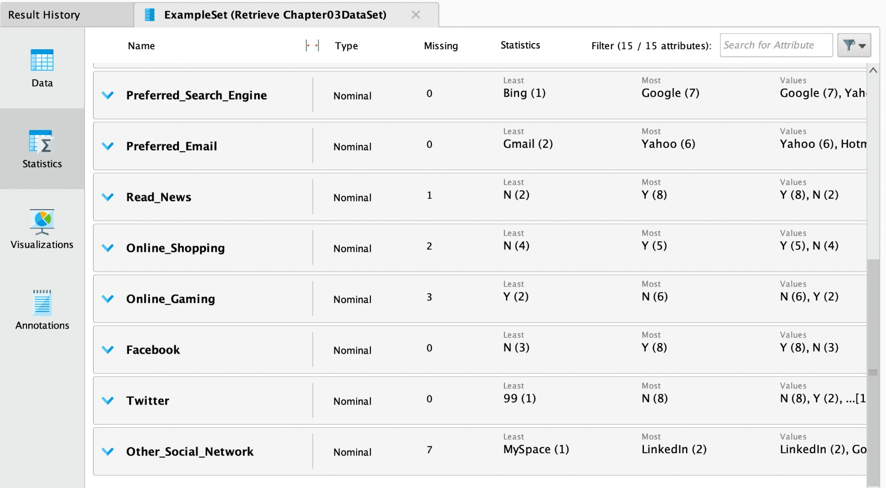

## Preparacion de datos
Los datos no son perfectos. Como todo lo demás en la vida, están sujetos a errores humanos, inconsistencias, errores ortográficos e información incompleta, repetida o redundante.
La idea de la preparacion de datos (data scrubbing) es mejorar estos aspectos del detaset para poder entrenar modelos que arrojen predicciones mas certeras.

### Analisis de distribuciones
// TODO

### Outliers
// TODO

### Manejo de datos faltantes
Son datos que no existen en el dataset. Dependiendo del contexto es posible que sea valido dejarlo como está o reemplazarlo con algún valor. No siempre es un problema.

En RapidMiner, podemos ver informacion de cada atributo, en este caso lo que nos interesa son los valores faltantes. Podemos ver en este caso que *Read_News*, *Online_Shopping*, *Online_Gaming* y *Other_Social_Network* cuentan con valores faltantes

Existe el operador *Replace Missing Values* que nos permite manejar esta situacion. Podemos elegir uno o varios atributos y reemplazar los valores faltantes por:
- El maximo valor para ese att
- El minimo valor para ese att
- El promedio
- 0
- Un valor especifico

### Reducción de datos 
La idea es filtrar los datos (registros) que no vayan a ser de utilidad.

Se utiliza el operador *Filter Attributes* con las condiciones que el dataset resultado esperamos que cumpla. Puede utilizarse para eliminar outliers, valores que no pertenezcan a un rango preestablecido u como otra forma de manejar los valores faltantes (si no cuenta con un valor para el atributo X, elimino el registro completo).

### Manejo de datos inconsistentes

Ocurre cuando el valor existe pero no es válido o significativo.

En el ejemplo, se puede observar que el atributo *Twitter* cuenta con 3 valores posibles: *Y*, *N* y *99* ... *99*?
No parece ser un valor esperado para este tipo de atributo, es inconsistente.

El operador *Replace* puede ser de utilidad, ya que nos permite seleccionar el atributo y reemplazar el valor atípico *99* por uno mas razonable, *N*.
No siempre es tan sencillo solucionar las inconsistencias dentro de un dataset, podría tomar varios reemplazos y/o operadores de datos faltantes para preparar el conjunto de datos.

### Reducción de atributos

En todo dataset pueden haber atributos irrelevantes, que no aporten al proposito de predecir la variable objetivo. Si reducimos la cantidad de funciones, los modelos generalmente se entrenan mucho más rápido. Y, a menudo, el modelo resultante es más simple y fácil de entender.

RapidMiner puede eliminar esos atributos en la vista sin eliminarlos del dataset, porque el hecho de que no sean de utilidad para este caso no significa que nunca vayan a ser relevantes.

Hay diversas formas de reducir atributos. Puede ser realizado manualmente, con el operador *Select Attributes*.

Tambien se cuenta con algoritmos para cumplir con este objetivo, dependiendo de la necesudad y tipos de datos presentes en el dataset

## Tipos de algoritmos

### Descenso de Gradiente y Regresión Lineal
// TODO

### Regresión Logística
// TODO

### Análisis Discriminante Lineal

### k-NN
// TODO

### Naive Bayes
// TODO

## Bibliografia

- North, M. (2012). Data Mining for the Masses.
- Brownlee, J. (2016). Master Machine Learning Algorithms.